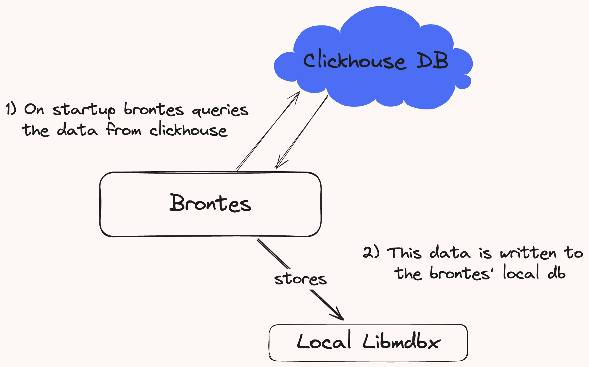
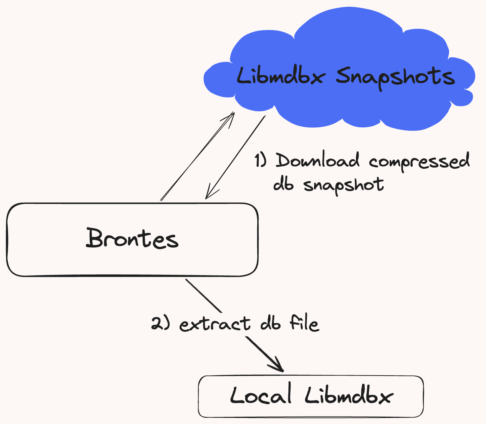
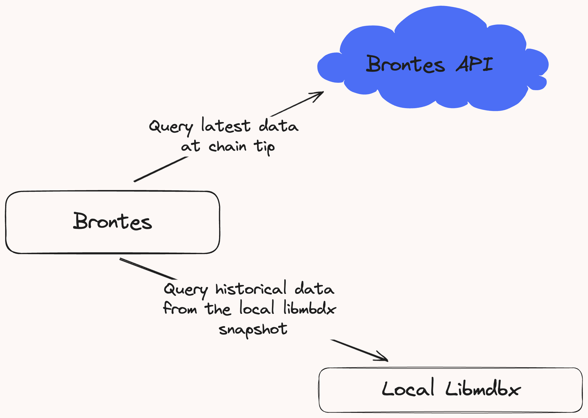

# Brontes Database

Brontes uses a local libmdbx database to store off-chain data for its analysis pipeline. The data comes from a Clickhouse database managed by Sorella Labs. It includes exchange pricing, trade data, mempool and relay data, address metadata, and more. For details on the specific tables and their schemas, see the [Tables Schema](./tables_schema.md) page.

## Database Sync

On startup, Brontes syncs its local database by downloading the needed data from Clickhouse.

<div style="text-align: center;">
    
    <p style="font-style: italic;">Figure 1: Data download from Clickhouse to Brontes local storage</p>
</div>

### Snapshot Sync

To manage cloud egress costs, we don't currently provide api access to our clickhouse database for historical sync. Instead, users must download the latest db snapshot made available every Monday and Thursday. See the [Installation Guide](../../installation/installation.md) for detailed instructions.

<div style="text-align: center;">
    
    <p style="font-style: italic;">Figure 2: User db snapshot download process.</p>
</div>

### Live Sync

Users that want to run brontes at chain tip, must request API access to query the data at chain tip. Configuration details for API access can be found in the [Installation Guide](../../installation/installation.md).

## Data Flow

Brontes adapts its data retrieval method based on its operational mode: for historical block analysis, it accesses the pre-stored data locally from its libmdbx database; when operating at chain tip, it retrieves metadata through the Brontes API.

<div style="text-align: center;">
    
    <p style="font-style: italic;">Figure 3: Querying methods for historical blocks and chain tip.</p>
</div>

The [`Metadata`](https://sorellalabs.github.io/brontes/docs/brontes_types/db/metadata/struct.Metadata.html) struct centralizes the essential information required for analysis, it is used by all [`Inspectors`](https://sorellalabs.github.io/brontes/docs/brontes_inspect/index.html) during their analysis.

```rust,ignore
pub struct Metadata {
    pub block_metadata: BlockMetadata,
    pub cex_quotes:     CexPriceMap,
    pub dex_quotes:     Option<DexQuotes>,
    pub builder_info:   Option<BuilderInfo>,
    pub cex_trades:     Option<Arc<Mutex<CexTradeMap>>>,
}
```

- **DEX Pricing:**: Comprehensive DEX pricing with transaction-level granularity for all active tokens in the block.
- **CEX Quotes and Trades:** Quotes (or trades data if brontes is built with the `cex-dex-markout` feature flag), from all major cryptocurrency exchanges.
- **Mev-Boost data:** Fee recipient & mev reward.
- **P2P Data:**
  - List of the block's private transactions and the block p2p timestamp, which marks the first time a fiber node received the block, sourced from Chainbound.
  - Relay submission timestamp.
- **Builder Info:** The block builder's info, including its name, associated funds, BLS public keys, integrated searcher EOAs and contracts addresses, and its ultrasound relay collateral addresses.

## Peripheral Data

**Core Data:**

- TokenDecimals
- AddressToProtocolInfo

**Metadata:**

- BuilderInfo
- SearcherInfo
  - SearcherEOAs
  - SearcherContracts
- Address Metadata

**Mev Data:**

- Mev Blocks

**Miscellaneous:**

- PoolCreationBlocks
- InitializedState
