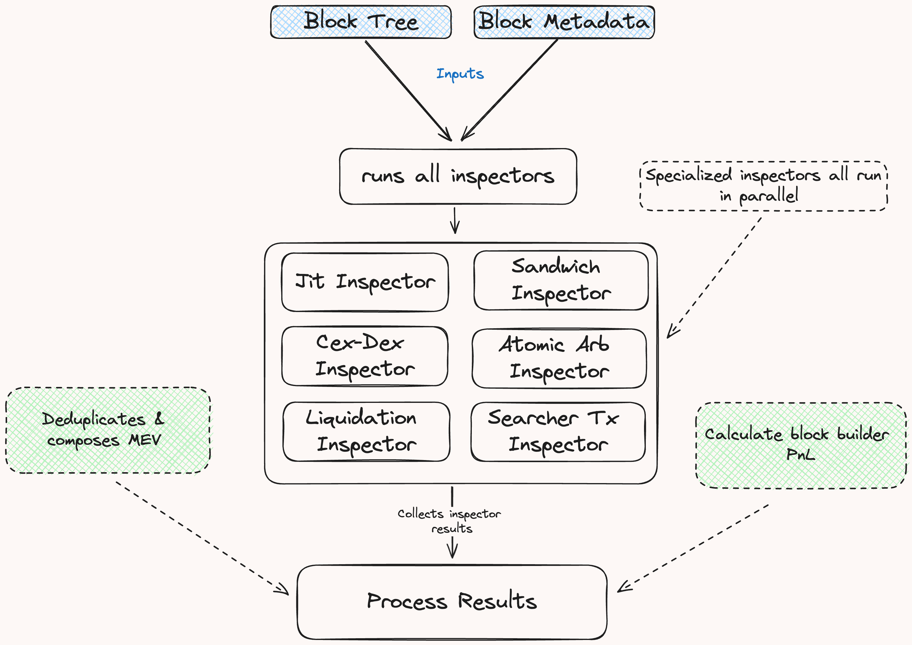

# Inspectors

Inspectors are run at the final stage of the block pipeline. Each Inspector applies its own specialized logic to analyze a block, using the [`BlockTree`](./tree.md#block-tree) and [`Metadata`](./database/database.md#1-block-specific-data) provided during execution. Defined as a trait, `Inspectors` allow developers to build custom implementations tailored to their analytical needs.

## Inspector Trait

The `Inspector` trait defines the `inspect_block` method, where you implement your analysis logic. This method accepts [`BlockTree`](./tree.md#block-tree) and [`Metadata`](./database/database.md#1-block-specific-data) as inputs and returns a `Result` type that you specify, allowing you to customize the output to meet your analytical needs.

```rust,ignore
#[async_trait::async_trait]
pub trait Inspector: Send + Sync {
    type Result: Send + Sync;

    async fn inspect_block(
        &self,
        tree: Arc<BlockTree<Action>>,
        metadata: Arc<Metadata>,
    ) -> Self::Result;
}
```

## Mev Inspectors

The `brontes_inspect` crate includes several MEV-inspectors, each implementing the Inspector trait to identify specific MEV types. Follow the links below to learn more about each their methodologies:

- [Cex-Dex Arbitrage](../mev_inspectors/cex-dex-quotes.md)
- [Sandwich Attacks](../mev_inspectors/sandwich.md)
- [Atomic Arbitrage](../mev_inspectors/atomic-arb.md)
- [JIT Liquidity](../mev_inspectors/jit-liquidity.md)
- [Liquidation](../mev_inspectors/liquidation.md)

## Workflow of Default Inspectors

The default inspector workflow is as follows:

<div style="text-align: center;">
 
</div>

### Step 1: Run All Inspectors

All specialized inspectors are run in parallel.

### Step 2: Compose & Filter MEV Results

Once all inspectors have completed their analysis we attempt to compose MEV results & filter duplicates.

**1: Composition Phase**:

The composition phase integrates results from various inspectors to form complex MEV strategies using the [`MEV_COMPOSABILITY_FILTER`](https://github.com/SorellaLabs/brontes/blob/1448e90a30fb856a77e0d4a2cffc6048eef03056/crates/brontes-inspect/src/composer/composer_filters.rs#L21). This filter specifies combinations of child MEVs—such as Sandwich and JIT—that merge into a more complex parent MEV, like JIT Sandwich, through a designated `ComposeFunction`.

The [`try_compose_mev`](https://github.com/SorellaLabs/brontes/blob/1448e90a30fb856a77e0d4a2cffc6048eef03056/crates/brontes-inspect/src/composer/mod.rs#L209) function applies these rules to the sorted MEV data, seeking out matching transaction hashes among the specified MEV types. When all required child MEV types for a combination are present, they are consolidated into a single, composite parent MEV instance.

**2: Deduplication Phase**:

Inspectors, such as those identifying atomic arbitrages and sandwich attacks, may label the same transaction as different MEV types due to overlapping criteria. For instance, the backrun transaction of a sandwich attack will also appear as a profitable arbitrage opportunity to the atomic arbitrage inspector. To resolve such overlaps we deduplicate inspector results ensuring that each classified MEV bundle is correctly classified.

**How Deduplication Works:**

The [`MEV_DEDUPLICATION_FILTER`](https://github.com/SorellaLabs/brontes/blob/1448e90a30fb856a77e0d4a2cffc6048eef03056/crates/brontes-inspect/src/composer/mev_filters.rs#L32) provides a structured way to prioritize MEV types in scenarios where the classification of a transaction overlap. This filter establishes a hierarchy among detected MEV types, specifying which type should take precedence in the final analysis. For example, in cases involving both atomic backrun and sandwich classifications, the filter dictates that the sandwich type, being more comprehensive, should take precedence over the simpler atomic arbitrage.

### Step 3: Calculate Block Builder PnL

After processing the inspector results, we [calculate the block builder’s PnL](https://github.com/SorellaLabs/brontes/blob/1448e90a30fb856a77e0d4a2cffc6048eef03056/crates/brontes-inspect/src/composer/utils.rs#L195), taking into account their revenues and costs:

- **Revenues:**

  - **Builder Revenue:** Total of all priority fees and tips paid to the builder within the block.
  - **MEV Revenue:** Profits or losses from MEV searchers operated by the builder.

- **Costs:**
  - **Proposer Payments:** ETH paid by the builder to the block proposer.
  - **Transaction Sponsorship:** ETH spent by the builder to [sponsor](https://titanbuilder.substack.com/p/titan-tech-teatime-1) transactions within the block.

> **Note:** Some builders secretly refund parts of priority fees to searchers or order flow generators (tg bots for example). We can't track these kickbacks without knowing the addresses involved. If you have this information, please share it to help us improve our calculations.

### Step 4: Store Results

Finally the resulting [`MevBlock`](./database/schema/mev_blocks.md#mevblock-fields) and [`Vec<Bundles>`](./database/schema/mev_blocks.md#bundle-fields) are written to the database in the `MevBlocks` table.

## Building New Inspectors

This section explores the common patterns and shared utilities used in building inspectors.

### Shared Utilities and Patterns

To create a new inspector, you'll typically follow these steps:

1. Implement the `Inspector` trait, defining the `inspect_block` method.
2. Use `BlockTree` methods to collect relevant actions and their corresponding transactions.
3. Analyze the transaction or block(s) (if multi transaction mev or cross block mev) to pattern match, you can also analyze profitability in a more generalized way (but you'll need great heuristics!)
4. Leverage the metadata in `TxInfo` to contextualize the transaction and apply fine tuned filtering to minimize false positives.
5. Return results in the format defined by your inspector.

Now that you're familiar with the high level pattern, let's go a bit deeper and explore how that looks in practice.

#### Block Tree Navigation

Inspectors typically start by specifying which transactions they're interested in. This is done using the `collect_all` method on the `BlockTree`:

```rust,ignore
let search_args = TreeSearchBuilder::default()
    .with_actions([Action::is_transfer, Action::is_eth_transfer]);
let (hashes, transfers): (Vec<_>, Vec<_>) = tree.clone().collect_all(search_args).unzip();
```

This method allows inspectors to efficiently filter and collect relevant actions of interest from the block, forming the foundation for further analysis.

#### Rich Transaction Metadata

Each transaction comes with a wealth of metadata encapsulated in the `TxInfo` struct. This includes:

- Basic transaction details (block number, index, hash)
- Addresses involved (EOA, MEV contract)
- Gas usage information
- Classification flags (private transaction, verified contract, etc.)
- Info on the searcher EOA & Contract if applicable

The `TxInfo` struct provides easy access to this metadata, allowing inspectors to make informed decisions based on comprehensive transaction context. For full details on the available metadata, refer to the [metadata tables](../architecture/database/schema/metadata.md) in the database schema section.

#### Shared Inspector Utilities

The `SharedInspectorUtils` struct offers a collection of helper methods common to many inspector implementations. These include:

- Computing the transaction balance deltas and address value deltas
- Bundle accounting
- Price validation / sanity checks
- Generically identify swaps using transfers

These utilities streamline the process of building complex inspectors by providing reusable, battle-tested components.

#### Adding Custom Metadata

These configuration files allow you to specify detailed metadata for builders, searchers, and general address classifications.

#### Builder Configuration

The builder configuration file is used to specify information about builders, including their operational details and associated entities:

**Example of a builder configuration:**

```toml
[builders."0x95222290DD7278Aa3Ddd389Cc1E1d165CC4BAfe5"]
name = "beaverbuild"
fund = "Symbolic Capital Partners"
pub_keys = [
  "0x93582c97ac58670ba118aae52cf6355d8c680a2a538bf77c90873e3fe7ddc0a6dd231e2e2ea06bdc07e9b160883512a3",
  ...
]
searchers_eoas = [
  "0x0cac3d1a887206e0f6169222C4504301A8b4b993",
  ...
]
searchers_contracts = [
  "0xFA103c21ea2DF71DFb92B0652F8B1D795e51cdEf",
  ...
]
ultrasound_relay_collateral_address = "0xa83114a443da1cecefc50368531cace9f37fcccb"
```

The searcher addresses are used to calculate the builder mev profit, that is, the mev profit that a builder makes from the searchers it operates.

The ultrasound relay collateral address is used to calculate the correct amount paid to the validator after their block bid was bid adjusted.

#### Searcher Configuration

You can define the fund and builder associations along with the types of MEV (Maximal Extractable Value) strategies they are known for:

**Example of a searcher configuration:**

```toml
[searcher_eoas."0xDBF5E9c5206d0dB70a90108bf936DA60221dC080"]
fund = "Wintermute"
mev_types = ["CexDexQuotes", "CexDexTrades"]
builder = "0x1f9090aaE28b8a3dCeaDf281B0F12828e676c326"
```

You can also specify sibling searchers associated with the same fund or entity:

```toml
[searcher_contracts."0x3FAcE0004bC1003B9d0672e7B23134Cb80115fb6"]
fund = "NC"
sibling_searchers = ["0x3FAcE0004bC1003B9d0672e7B23134Cb80115fb6", "0xA0d5a274F95DEcB536BbBAA922D6D0Fb692a627D"]
```

Defining sibling searchers and builder addresses ensures accurate profit attribution. This configuration allows Brontes to aggregate profits across related entities, preventing misattribution and providing a comprehensive view of performance. Without it, individual searchers might be incorrectly labeled as unprofitable or highly profitable when they're part of a larger operation.

Manually categorizing searchers by their specific MEV strategies in the configuration file can be advantageous when fine-tuning bundle filtering criteria. This approach allows for more flexible analysis by:

1. Relaxing the strictness of heuristics for addresses explicitly labeled as MEV bots for specific strategies.
2. Adjusting criteria for addresses with a high count of previously detected bundles.

These adjustments enable more nuanced and inclusive MEV detection, particularly for well-established or manually verified searchers.

#### Address Metadata Config

The Address Metadata Config lets you customize or add metadata to a given address. You can specify information about associated entities, contract information, and social metadata.

This configuration is especially valuable for excluding specific addresses from analysis or for applying custom handling to addresses with known edge cases that are challenging to incorporate into the general model.

> **Alpha Leak:** We have accumulated extensive metadata, labels, and types that aren't yet fully utilized in our codebase. For the astute developer who can systematically categorize and integrate these data points, there's significant potential to create highly sophisticated long-tail MEV inspectors. If you're interested in working on this project, please reach out to us.

**Example of an address metadata configuration:**

```toml
[metadata."0x111111125421cA6dc452d289314280a0f8842A65"]
entity_name = "1inch"
nametag = "1inch v6: Aggregation Router"
labels = ["DEX", "Aggregation Router V6", "SC:sourcecodeverified", "1inch", "CN:AggregationRouterV6"]
address_type = "dex-aggregator"

[metadata."0x111111125421cA6dc452d289314280a0f8842A65".contract_info]
verified_contract = true
contract_creator = "0xccbdbd9b0309a77fc6a56e087ff2765ff394012e"
reputation = 1

[metadata."0x111111125421cA6dc452d289314280a0f8842A65".social_metadata]
twitter = "https://twitter.com/1inch"
website_url = "https://app.1inch.io/"
crunchbase = "https://www.crunchbase.com/organization/1inch-limited"
linkedin = "https://www.linkedin.com/company/1inch"
```
