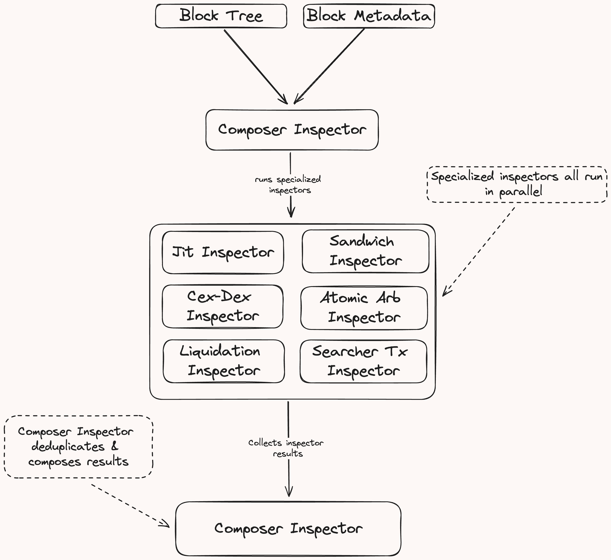

# Inspectors

The Brontes Inspector Framework epitomizes our aversion to the tediousness of data preparation. It seamlessly processes classified blocks and metadata, allowing developers to immerse themselves fully in analysis and methodology, free from the burdens of preprocessing.

Our initial focus has been on MEV detection, particularly in Cefi-Defi arbitrage and Jit-Liquidity Sandwiching. However, the inspector framework’s versatile design lends itself to a wide array of analytics scenarios.

The `brontes_inspect` crate efficiently detects and analyzes MEV, emphasizing modularity and ease of use. This crate provides a robust foundation for developing custom inspectors, streamlining the identification of MEV strategies. By abstracting complex tasks such as decoding, normalization, metadata fetching, and price tracking, `brontes_inspect` allows developers to concentrate on the unique logic of their MEV detection strategies. This design philosophy ensures seamless integration of custom inspectors tailored to specific MEV strategies, without delving into underlying infrastructure details.

## Inspector Trait

An `Inspector` is a trait defining the `process_tree` method, which takes a `BlockTree` and `Metadata` as input, returning a vector of tuples, each containing a `BundleHeader` and a `BundleData`.

```rust
#[async_trait::async_trait]
pub trait Inspector: Send + Sync {
    type Result: Send + Sync;

    async fn process_tree(
        &self,
        tree: Arc<BlockTree<Action>>,
        metadata: Arc<Metadata>,
    ) -> Self::Result;
}
```

The `BlockTree` represents a block of classified and normalized Ethereum transactions and their traces. The `Metadata` contains price information and relevant off-chain data, such as mempool data and centralized exchange price data relevant to that block. The `process_tree` method analyzes the block, identifying instances of the MEV strategy that the inspector is designed to detect.

<div style="text-align: center;">
 
</div>

### MEV Inspectors

The `brontes_inspect` crate provides several individual inspectors, each designed to detect a specific type of MEV strategy. These inspectors are defined in their respective modules:

- `atomic_backrun`
- `cex_dex`
- `jit`
- `sandwich`
- `liquidations`
- `long_tail`

Each inspector implements the `Inspector` trait, providing its unique implementation of the `process_tree` method.

#### Composer

The `Composer` is a special type of inspector that combines the results of individual inspectors to identify more complex MEV strategies. It takes an array of individual inspectors, a `BlockTree`, and `Metadata` as input, running each inspector on the block and collecting their results.

```rust
pub struct Composer<'a, const N: usize> {
    inspectors_execution: InspectorFut<'a>,
    pre_processing:       BlockPreprocessing,
}
```

The `Composer` defines a filter to order results from individual inspectors, ensuring lower-level actions are composed before higher-level actions, which could affect the composition. Additionally, the `Composer` provides a `Future` implementation for asynchronous contexts. When polled, it runs the individual inspectors in parallel, collecting and processing their results to identify complex MEV strategies.
