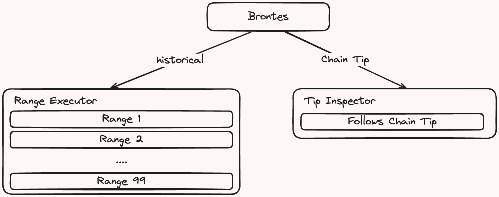
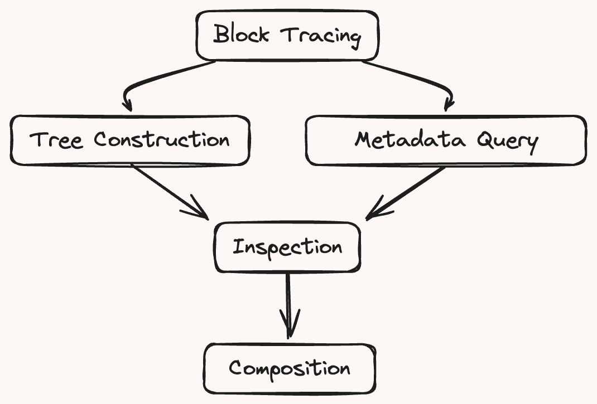

# Brontes Architecture

## How Brontes Works?

Brontes progress is driven by two distinct modules, the range & tip module.

For historical blocks, brontes will run with the Range executor, which will break up the block range into smaller chunks and run each chunk in parallel.

If no end range is specified, brontes will create range executors for the historical range & will spawn a tip inspector at the most recent block, which is immediately spawned upon start and follows the chain tip.

 

Brontes transforms raw Ethereum transaction traces into a structured, analyzable format. Below is a high level overview of the pipeline:

 

1. **Block Tracing**: First, using a custom `revm-inspector` it generates all transaction traces for a block.

2.

a. **Tree Construction**: Constructs a tree of all transactions within a block, encapsulating each transaction in its own `TransactionTree`, which preserves the execution order and context. During this process, it classifies each Trace call into a `NormalizedAction` if a classifier is implemented for the given function call.

b. **Metadata Integration**: In parallel to the tree construction, Brontes fetches and integrates relevant metadata, such as DEX pricing, exchange pricing, and private transaction sets. For more information, see the [database](./database.md) section.

4. **Normalization**: Brontes employs [Classifiers](./classifiers.md) to normalize the raw traces into standardized `NormalizedActions`, establishing a consistent analytical framework across different DeFi protocols.

5. **Inspection**: The classified blocks, enriched with metadata, are passed to the [Inspector Framework](./inspectors.md). Inspectors process the classified blocks and metadata to identify various forms of MEV. The modular nature of the Inspector Framework allows developers to easily integrate additional inspectors.

6. **Composition**: The individual inspector results are collected by the composer, a higher-level inspector that identifies complex MEV strategies composed of multiple MEV actions.
