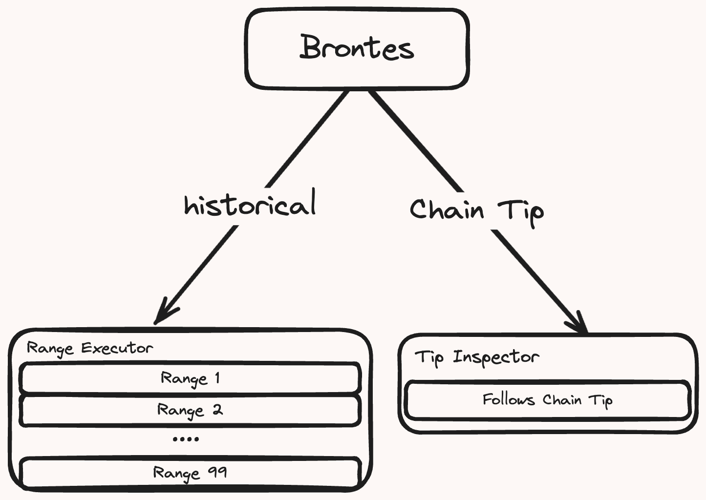
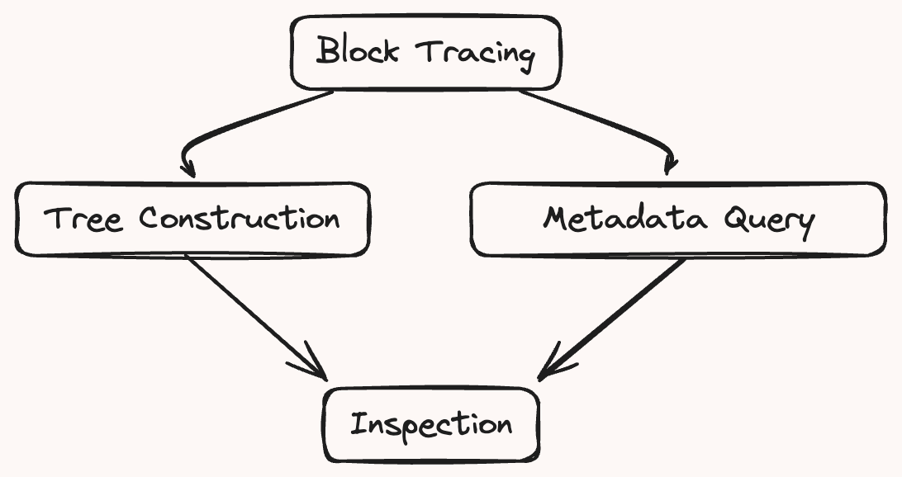

# Brontes Architecture

## High-Level Overview

Brontes is designed to process Ethereum transaction traces, leveraging two core execution modes to handle data: the Range Executor and the Tip Inspector.

 

### Range Executor

The Range Executor is Brontes' engine for historical block processing. It takes a specified block range of blocks and divides it into chunks. These chunks are processed in parallel.

### Tip Inspector

The Tip Inspector comes into play when following chain tip. Upon initiation, it immediately targets the most recent block and processes blocks as they come in. This mode is automatically engaged when no end block range is specified upon startup.

## Block Pipeline

Both the Range Executor and Tip Inspector follow the same block processing pipeline.

 

1. **Block Tracing**: Generates the block trace using a custom `revm-inspector`

2. **Tree Construction**: Constructs a `BlockTree` encapsulating each transaction in its own `TransactionTree`. Traces are classified into `NormalizedActions`. See [BlockTree](tree.md) for more details.

3. **Metadata Integration**: In parallel to the tree construction, Brontes fetches the block metadata from the brontes [database](./database.md), composed of DEX pricing, CEX pricing, private transaction sets and more.

4. **Inspection**: Specialized [Inspectors](./inspectors.md) process the classified blocks and metadata to identify various forms of MEV. The results are collected & analyzed by the `Composer` (a sort of parent inspector) which composes & deduplicates the results and stores them in the local libmbx database.
