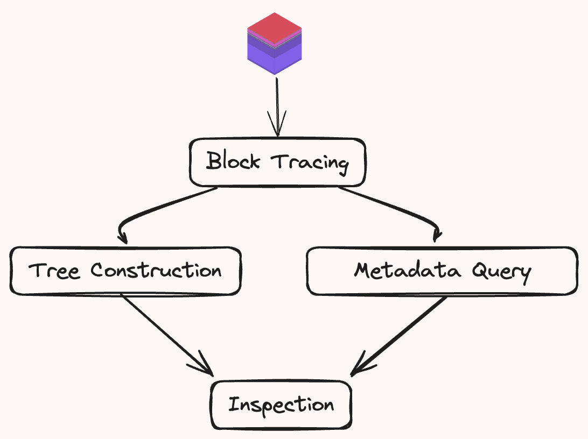

# Brontes Architecture

Brontes is designed for efficient analysis of both extensive historical block ranges and the latest chain state. It operates in two distinct modes: the Range Executor parallelizes the processing of historical data, while the Tip Inspector ensures it remains in sync with the chain tip.

 

- **Range Executor**: Processes historical block data. It divides a specified block range into chunks for concurrent processing.

- **Tip Inspector**: Ensures synchronization with the chain tip, automatically engaging at startup if no end block is specified. It begins by targeting the latest block and then processes each new block as it arrives.

## Block Pipeline

The Range Executor and the Tip Inspector both handle blocks through the same sequential processing pipeline. Each block is subject to the following four stages:

 

1. **Block Tracing**: Generates the block trace using a custom `revm-inspector`

2. **Tree Construction**: Constructs a [`BlockTree`](https://sorellalabs.github.io/brontes/docs/brontes_types/tree/struct.BlockTree.html) encapsulating each transaction in its own `TransactionTree`. Traces are classified into [`NormalizedActions`](https://sorellalabs.github.io/brontes/docs/brontes_types/normalized_actions/trait.NormalizedAction.html). See [Block Tree](tree.md) for more details.

3. **Metadata Query**: In parallel to the tree construction, Brontes fetches the block metadata from the brontes [database](./database/database.md), composed of DEX pricing, CEX pricing, private transaction sets and more.

4. **Inspection**: Specialized [Inspectors](./inspectors.md) process the classified blocks and metadata to identify various forms of MEV. The results are collected & analyzed by the [`Composer`](https://sorellalabs.github.io/brontes/docs/brontes_inspect/composer/index.html) (a sort of master inspector) which composes & deduplicates the results and stores them in the local libmbx database.
