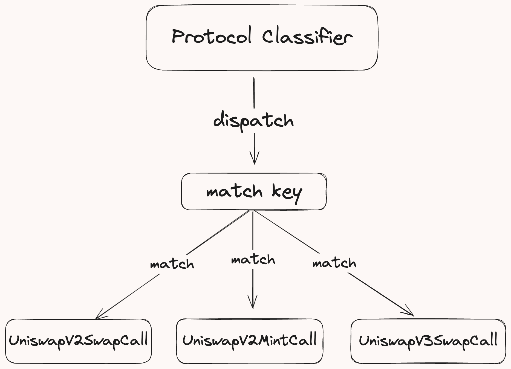

# Block Tree

The `BlockTree` decodes, and classifies a block's transaction traces into a collection of `TransactionTrees`, each representing a transaction's call hierarchy.

A `TransactionTree` structures EVM traces as a series of `Action`, which serve as the nodes of the tree. Each `Action` normalizes core DeFi operations, such as swaps, flash loans, and mints. This approach harmonizes idiosyncratic protocol implementations, generalizing their representation to establish a consistent analytical framework.

## Block Tree Building

At a high level, generating the Block Tree involves three primary steps:

<div style="text-align: center;">
 
</div>

1. **Fetching Raw EVM Data**: Brontes retrieves the transaction traces and the `BlockHeader` for a block, first querying the database. If the data is not available, it is generated using a custom `revm-inspector` and cached in the database for future use.

2. **Tree Building**: Traced transactions are individually passed to the TxTree builder which descends through the call hierarchy, classifying each trace into an `Action`. Decoding and normalization occur via the `dispatch` macro which routes call data to its `ProtocolClassifier`. See the [Action Classification](#action-classification) section for more.

3. **Processing**: The newly built BlockTree undergoes sanitization to account for tax tokens and duplicate transfers. It also classifies multi-call frame actions, which span multiple traces. More on this in the [Multi Call Frame Classification](#Multi-Call-Frame-Classification) section.

## Action Classification

Each transaction trace is classified into an `Action` and an optional `DexPriceMsg` if it should be priced. The diagram below illustrates the classification process:

<div style="text-align: center;">
 
</div>

### Protocol Classifier

The `ProtocolClassifier`, generated by the `action_dispatch` proc macro, orchestrates the call trace classification. This macro creates the `dispatch` function which routes each trace to its action classifier based on the protocol and function call. These classifiers decode and normalize trace data into a standardized `Action`. To incorporate new classifiers, developers simply add them in the macro invocation.

Here is an example of how you'd declare available classifiers using the `action_dispatch` macro:

```rust,ignore
action_dispatch!(
    ProtocolClassifier,
    UniswapV2SwapCall,
    PancakeSwapV2BurnCall,
    UniswapV3SwapCall,
    ...
);
```

#### Action Dispatch

The `dispatch` function routes each call trace to its classifiers through these steps:

<div style="text-align: center;">
 
</div>

1. **Retrieve Protocol Information**: Fetches the protocol associated with the trace's target address by querying the `AddressToProtocolInfo` table, consistently updated by the [`DiscoveryClassifier`](#discovery-classifiers).

2. **Create a Match Key**: Append the protocol to the function signature to form a match key.

3. **Identify the action classifier**: Compares the match key against the set of classifiers. If a match is found, `decode_call_trace` is called on the corresponding classifier, passing `CallInfo`, database connection (`db_tx`), `block`, and transaction index (`tx_idx`) as inputs.

#### Classifying the Action

The `decode_call_trace` method of the action classifier, generated by the `action_impl` proc macro, decodes & classifies the trace. Developers specify the expected data inputs and the transformation logic, and the macro handles all aspects of data decoding.

#### Understanding the `action_impl` Macro

The `action_impl` macro generates all necessary decoding logic based on specified flags — namely call data, logs, and return data — allowing developers to focus solely on how the data is transformed into a normalized Action.

Here’s a breakdown of the macro's usage:

```rust,ignore
action_impl!(
    ProtocolPath,            // Path to the protocol module
    PathToCall,              // Path to the alloy binding for that function
    CallType,                // The type of action, e.g., Swap, Mint
    [LogType],               // Array of log types, in the order they are emitted
    logs: bool,              // Flag to specify if logs should be decoded
    call_data: bool,         // Flag to specify if call data should be decoded
    return_data: bool        // Flag to specify if return data should be decoded
    call_function: ExprClosure, // Closure defining the logic to construct the action
);
```

#### Example: Classifying a Maker PSM Swap Action

Let's consider this macro invocation to classify swap actions for the Maker PSM module.

```rust,ignore
action_impl!(
    Protocol::MakerPSM,               // Path to the protocol module
    crate::MakerPSM::buyGemCall,      // Specifies the function
    Swap,                             // Action type
    [BuyGem],                         // Log type emitted by the function
    call_data: true,                  // Decode call data
    logs: true,                       // Decode log data
    |info: CallInfo,
     call_data: buyGemCall,
     log_data: MakerPSMBuyGemCallLogs,
     db_tx: &DB| {
        // Custom logic to process the data and classify the action into a swap action

        // Fetches the details of this contract
        let details = db_tx.get_protocol_details(info.target_address)?;

        // For the PSM, the token0 should always be set to DAI and token1
        // is the gem (USDC or USDP)
        let [token_0, token_1] = [details.token0, details.token1];

        // Retrieves the token symbol and decimals
        let t0_info = db_tx.try_fetch_token_info(token_0)?;
        let t1_info = db_tx.try_fetch_token_info(token_1)?;

        // Extracts the amount of tokens being bought from the decoded call data
        let amount_out = call_data.gemAmt.to_scaled_rational(t1_info.decimals);

        // Extracts the fee in DAI decimals from the decoded log
        let fee = log_data.buy_gem_field?.fee;
        let fee_amount = fee.to_scaled_rational(t0_info.decimals);

        // The amount of DAI being spent, amount out + fee
        let amount_in = &amount_out + &amount_out * fee_amount;

        // Returns the normalized swap action
        Ok(NormalizedSwap {
            protocol: Protocol::MakerPSM,
            trace_index: info.trace_idx,
            from: info.from_address,
            recipient: call_data.usr,
            pool: info.target_address,
            token_in: t0_info,
            token_out: t1_info,
            amount_in,
            amount_out,
            msg_value: info.msg_value,
        })
    }
);
```

In this implementation:

- The required inputs are specified via the flags (`call_data` and `logs`).
- The closure uses the decoded call data & logs to normalize the call into a `NormalizedSwap` action.

### Discovery Classifier

The `DiscoveryClassifier`, generated by the `discovery_dispatch` proc macro, manages the indexing of new protocol contracts. This macro creates the `dispatch` function which routes each create trace to its factory contract classifier. These classifiers the create trace a corresponding factory contract initialization function into a `NormalizedNewPool` action variant. To incorporate discovery for a protocol, developers simply add them in the macro invocation.

Here is an example of how you'd declare available factory classifiers using the `discovery_dispatch` macro:

```rust,ignore
discovery_dispatch!(
    DiscoveryClassifier,
    UniswapV2Discovery,
    UniswapV3Discovery,
    PancakeSwapV3Discovery,
    CurveV1MetaDiscovery,
    CurveV2PlainDiscovery0,
    ...
);
```

#### Discovery Dispatch

The `dispatch` function routes each call trace to its classifiers through these steps:

1. **Create a Match Key**: Gets the immediate parent call of the create trace to retrieve the factory contract address and the factory contract initialization function signature. Appends the factory address and the function signature to form a match key.

2. **Identify the factory classifier**: Compares the match key against the set of factory classifiers. If a match is found, `decode_create_trace` is called on the corresponding classifier, passing the `tracer`,`deployed_address`,`parent_calldata` (factory contract function call), and `trace_idx` as inputs.

#### Classifying the Contract

The `decode_call_trace` method of the factory classifier, generated by the `discovery_impl` proc macro, decodes the factory deploy function call to extract the contract parameters. Developers specify the factory address, function and transformation logic, and the macro handles the decoding.

#### Understanding the `discovery_impl` Macro

Here’s a breakdown of the macro's usage:

```rust,ignore
discovery_impl!(
    UniswapV2Discovery,                         // DiscoveryName
    crate::UniswapV2Factory::createPairCall,    //  Path::To::Factory::DeployCall
    0x5C69bEe701ef814a2B6a3EDD4B1652CB9cc5aA6f, // Factory Address
    |deployed_address: Address, trace_index: u64,
     _,                                         // Here the tracer is not used
     call_data: createPairCall|  async move {
        // Custom logic to classify the action into a new pool action

        // Extracts the token addresses from the factory deploy call data
        let token_a = call_data.tokenA;
        let token_b = call_data.tokenB;

        // Returns the normalized new pool action
        vec![NormalizedNewPool {
            pool_address: deployed_address,
            trace_index,
            protocol: Protocol::UniswapV2,
            tokens: vec![token_a, token_b],
        }]
    }
);
```

In this implementation:

- The closure uses the decoded call data from the factory deploy call and the deployed address from the CREATE trace to create a `NormalizedNewPool` action which contains all relevant information about this newly created Uniswap pool.

Adding a step for generating the necessary bindings for the Uniswap V3 factory and pool contracts will ensure that users have all the components they need for a complete classifier setup. Here's how to integrate this information into your existing guide:

## Implementing a New Classifier: Uniswap V3 Example

### Step 1: Generate Contract Bindings

Before implementing classifiers, you'll need to generate bindings for the Uniswap V3 factory and pool contracts. This involves the following steps:

1. Obtain the ABI for both the factory and pool contracts.
2. Place these ABI files in the [classifier-abis](https://github.com/SorellaLabs/brontes/tree/main/crates/brontes-classifier/classifier-abis) folder.
3. Use the alloy [`sol!`](https://docs.rs/alloy-sol-macro/0.7.2/alloy_sol_macro/macro.sol.html) macro to generate the contract bindings. Add the invocation to `brontes_classifier` [`lib.rs`](https://github.com/SorellaLabs/brontes/blob/db359290fe4e6872219a4bab3113e472b277df18/crates/brontes-classifier/src/lib.rs) file

```rust,ignore
sol!(UniswapV3Factory, "./classifier-abis/UniswapV3Factory.json");
sol!(UniswapV3, "./classifier-abis/UniswapV3.json");
```

> **Note**
>
> The `action_impl` and `discovery_impl` macros will automatically import the generated bindings.

Finally, add the protocol name to the `Protocol` enum in [`protocol.rs`](https://github.com/SorellaLabs/brontes/blob/db359290fe4e6872219a4bab3113e472b277df18/crates/brontes-types/src/protocol.rs#L66).

### Step 2: Adding a Discovery Classifier for Uniswap V3

Implement a discovery classifier for the Uniswap V3 pools. This classifier will identify and classify new pools created via the Uniswap V3 Factory.

```rust,ignore
use alloy_primitives::Address;
use brontes_macros::discovery_impl;
use brontes_pricing::Protocol;


discovery_impl!(
    UniswapV3Discovery,                         // Discovery classifier name
    crate::UniswapV3Factory::createPoolCall,    // Path to the deploy call binding
    0x1F98431c8aD98523631AE4a59f267346ea31F984, // Factory address
    |deployed_address: Address, trace_index: u64,
     call_data: createPoolCall, _| async move {
        // Extract the pool token addresses from the factory deploy function call data
        let token_a = call_data.tokenA;
        let token_b = call_data.tokenB;

        // Return the normalized new pool action
        vec![NormalizedNewPool {
            pool_address: deployed_address,
            trace_index,
            protocol: Protocol::UniswapV3,
            tokens: vec![token_a, token_b],
        }]
    }
);
```

Add the new discovery classifier to the `discovery_dispatch!` macro in the classifiers [`mod.rs`](https://github.com/SorellaLabs/brontes/blob/db359290fe4e6872219a4bab3113e472b277df18/crates/brontes-classifier/src/classifiers/mod.rs#L43):

```rust,ignore
discovery_dispatch!(
    DiscoveryClassifier,
    SushiSwapV2Discovery,
    UniswapV2Discovery,
    UniswapV3Discovery
);
```

### Step 3: Implementing an Action Classifier for Uniswap V3 Mint Function

Define an action classifier for the Uniswap V3 mint function to process mint actions:

```rust,ignore
use brontes_macros::action_impl;

action_impl!(
    Protocol::UniswapV3,
    crate::UniswapV3::mintCall, // Path to the alloy binding for the mint function
    Mint,                       // Action type
    [Mint],                     // Log type emitted by the mint function
    return_data: true,          // Decode return data
    logs: true,                 // Decode logs
    call_data: true,            // Decode call data
     |
     info: CallInfo,
     call_data: mintCall,
     return_data: mintReturn, _logs: UniswapV3MintCallLogs,  db_tx: &DB| {
        // Extract the token deltas from the decoded return data
        let token_0_delta = return_data.amount0;
        let token_1_delta = return_data.amount1;

        // Fetch the protocol details from the database
        let details = db_tx.get_protocol_details_sorted(info.target_address)?;
        let [token_0, token_1] = [details.token0, details.token1];

        // Fetch the token info from the database
        let t0_info = db_tx.try_fetch_token_info(token_0)?;
        let t1_info = db_tx.try_fetch_token_info(token_1)?;

        // Convert U256 to malachite Rational using the token decimals
        let am0 = token_0_delta.to_scaled_rational(t0_info.decimals);
        let am1 = token_1_delta.to_scaled_rational(t1_info.decimals);

        // Return the normalized mint action
        Ok(NormalizedMint {
            protocol: Protocol::UniswapV3,
            trace_index: info.trace_idx,
            from: info.from_address,
            recipient: call_data.recipient,
            pool: info.target_address,
            token: vec![t0_info, t1_info],
            amount: vec![am0, am1],
        })
    }
);
```

- Check out the full Uniswap V3 action implementation, which also includes swap, burn, and collect functions [here](https://github.com/SorellaLabs/brontes/blob/main/crates/brontes-classifier/src/classifiers/uniswap/uniswap_v3.rs).

Register the new action classifier in the `action_dispatch!` macro in the classifiers [`mod.rs`](https://github.com/SorellaLabs/brontes/blob/db359290fe4e6872219a4bab3113e472b277df18/crates/brontes-classifier/src/classifiers/mod.rs#L68):

```rust,ignore
action_dispatch!(
    ProtocolClassifier,
    UniswapV2SwapCall,
    UniswapV2MintCall,
    UniswapV3MintCall
);
```

**And that's it! You've successfully implemented support for automated pool discovery and mint action classification for Uniswap V3.**

## Multi Call Frame Classification

In certain scenarios, actions extend beyond a single trace and involve nested actions that span through the child call frames, such as flash loans or aggregator swaps. Multi call frame classification is designed to handle such scenarios, where a single call-frame is insufficient for complete action classification.

### Process

1. **Mark Complex Classification during classification**: When we classify a trace into an action that requires multi call frame classification, we mark the trace index for retrieval during the multi call frame classification phase.
2. **Request Retrieval**: After all traces are classified, retrieve multi call frame classification requests and process each request in reverse transaction tree order. This ensures that nested complex classifications are handled correctly.
3. **Child Node Retrieval**: For each classification request, retrieve all child nodes relevant to the action, as specified by the `MultiCallFrameClassifier` implementation.

### Example: AaveV2 Liquidation

Consider the AaveV2 classifier for a liquidation action, which requires fetching all child transfer actions. Here’s how the classifier is implemented:

```rust,ignore
fn create_classifier(request: MultiFrameRequest) -> Option<MultiCallFrameClassification<Action>> {
    Some(MultiCallFrameClassification {
        trace_index: request.trace_idx,
        tree_search_builder: TreeSearchBuilder::new().with_action(Action::is_transfer),
        parse_fn: Box::new(parse_v2_v3),
    })
}
```

This function retrieves the relevant child actions for a node and passes them to a parsing function that finalizes the classification of the complex action. These actions are then integrated into the main action and pruned from the tree to prevent duplication.

```rust,ignore
fn parse_v2_v3(this: &mut Action, child_nodes: Vec<(NodeDataIndex, Action)>) -> Vec<NodeDataIndex> {
    let this = this.try_liquidation_mut().unwrap();
    child_nodes.into_iter().find_map(|(index, action)| {
        if let Action::Transfer(transfer) = action {
            if transfer.to == this.liquidator {
                this.liquidated_collateral = transfer.amount;
                return Some(index);
            }
        }
        None
    })
    .map(|e| vec![e])
    .unwrap_or_default()
}
```

## Classifier Configuration

The Classifier configuration file, located at `config/classifier_config.toml`, allows you to manually map contract addresses to their corresponding protocols when automated discovery is impractical.

### Configuration Example

Configure classifiers in TOML format as shown:

```toml
[AaveV3."0x5faab9e1adbddad0a08734be8a52185fd6558e14"]
init_block = 18979624

[[AaveV3."0x5faab9e1adbddad0a08734be8a52185fd6558e14".token_info]]
address = "0xa0b86991c6218b36c1d19d4a2e9eb0ce3606eb48"
decimals = 6
symbol = "USDC"

[[AaveV3."0x5faab9e1adbddad0a08734be8a52185fd6558e14".token_info]]
address = "0x2260fac5e5542a773aa44fbcfedf7c193bc2c599"
decimals = 8
symbol = "WBTC"
```

This configuration populates the `AddressToProtocolInfo` table, which maps contract addresses to detailed protocol data, which is used in the `dispatch` functions to apply the correct classifiers based on the contract address and protocol.

#### Important Notes

- **Protocol Compatibility**: The protocol name in the configuration must correspond to one listed in the protocol enum in [`protocol.rs`](https://github.com/SorellaLabs/brontes/blob/db359290fe4e6872219a4bab3113e472b277df18/crates/brontes-types/src/protocol.rs#L66).
- **Token Information**: Includes blockchain addresses, decimals, and symbols.
- **Initialization Block**: Marks at what block the contract was created.
