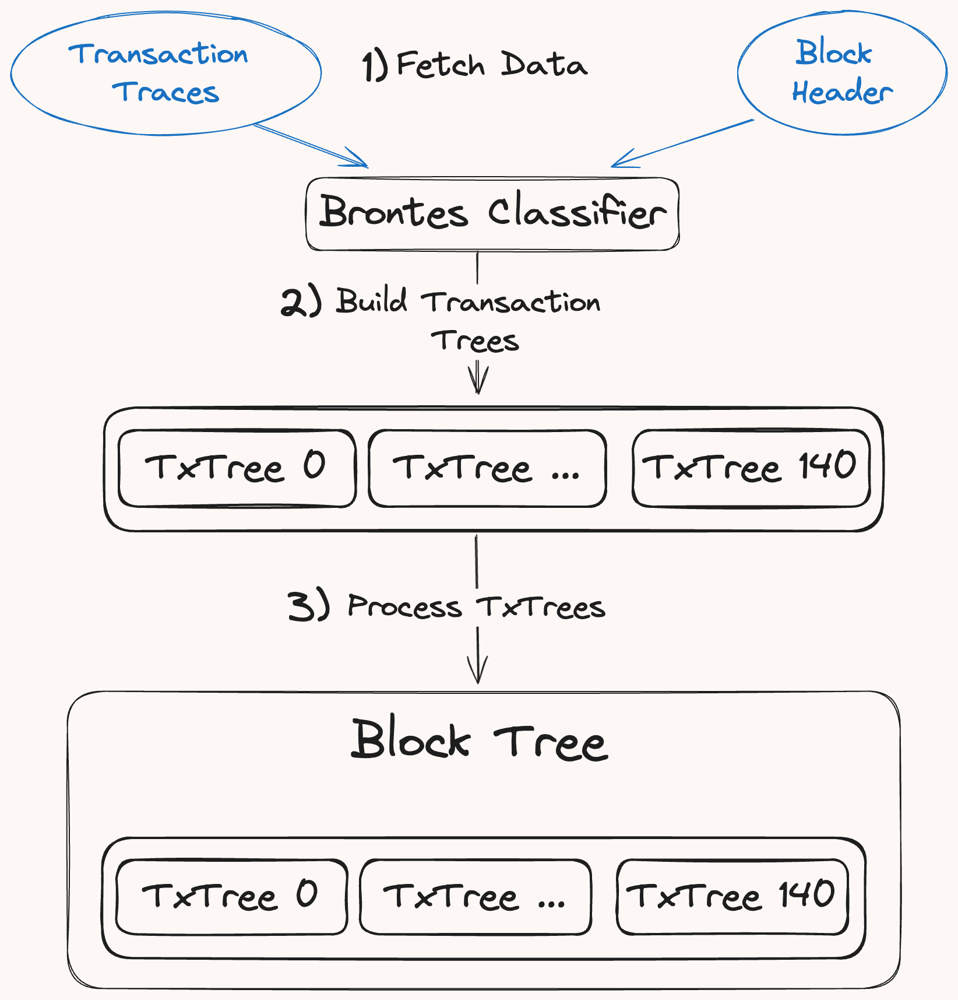
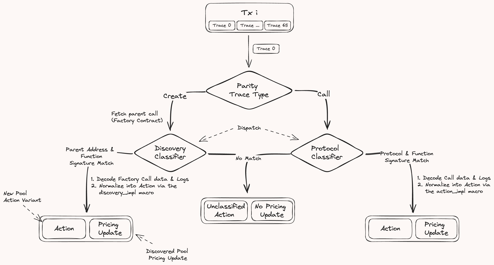

# Block Tree

The `BlockTree` decodes, classifies and normalizes a block's transaction traces into a collection of `TransactionTrees`, each representing a transaction's call hierarchy.

A `TransactionTree` organizes all EVM traces as a collection of `Action`, which form the nodes of the tree. Each `Action` normalizes core DeFi operations—such as swaps, flash loans, and mints—into a standardized format. This approach harmonizes idiosyncrasies between different DeFi protocol implementations, generalizing the representation of core primitives to establish a consistent analytical framework applicable across all protocols.

## Block Tree Building

At a high level, generating the Block Tree involves three primary steps:

<div style="text-align: center;">
 
</div>

1. **Fetching Raw EVM Data**: Brontes retrieves the transaction traces and the `BlockHeader` for a block, first querying the database. If the data is not available, it is generated using a custom `revm-inspector` and stored to accelerate reruns.

2. **Tree Building**: Traced transactions are individually passed to the TxTree builder which descends through the call hierarchy, classifying each trace into a normalized action. Decoding and normalization occur via the `dispatch` macro which routes call data to it's protocol classifier. See the [Action Classification](#action-classification) section for more.

3. **Processing**: The newly built BlockTree undergoes sanitization to account for tax tokens and duplicate transfers. It also classifies multi-call frame actions, which span multiple traces. More on this in the [Complex Classification](#complex-classification) section.

## Action Classification

Each transaction trace is classified into an `Action` and an optional `DexPriceMsg` if it should be priced. The diagram below illustrates the classification process:

<div style="text-align: center;">
 
</div>

### Protocol Classifiers

The `ProtocolClassifier`, generated by the `action_dispatch` proc macro, orchestrates the call trace classification. When invoked, this macro expects a list of action classifiers, each designed to handle a specific function and protocol. These classifiers then become potential destinations within the `dispatch` function’s routing logic.

The following code snippet shows how to use the `action_dispatch` macro to define the set of available classifiers:

```rust
action_dispatch!(
    ProtocolClassifier,
    UniswapV2SwapCall,
    UniswapV2MintCall,
    SushiSwapV2SwapCall,
    PancakeSwapV2BurnCall,
    UniswapV3SwapCall,
    ...
);
```

#### Action Dispatch

The `dispatch` function responsible for routing, will:

1. **Retrieving Protocol Information**: Queries the database with `get_protocol` to query for the protocol related to the call trace target address.

2. **Creating a Match Key**: Extracts the selector from the trace call data and appends the protocol byte to the function signature to form a match key.

3. **Signature Matching**: Compares the match key against the set of classifiers. If a match is found, the associated classifier is invoked, taking the `CallInfo`, database connection (`db_tx`), `block`, and transaction index (`tx_idx`) as inputs.

### Classifying the Action

Once a matching classifier is found within the `ProtocolClassifier` dispatch function, it invokes the classifier’s `decode_trace_data` function. This function is defined using the `action_impl` procedural macro, which allows for specifying the necessary inputs such as call data, logs, and return data. This procedural macro facilitates the transformation of raw trace data into a structured and normalized action by implementing user-defined logic.

For example, a classifier for the MakerPSM protocol might be defined as follows to process swap actions:

```rust
action_impl!(
    Protocol::MakerPSM,
    crate::MakerPSM::buyGemCall,
    Swap,
    [BuyGem],
    call_data: true,
    logs: true,
    |info: CallInfo, call_data: buyGemCall, log_data: MakerPSMBuyGemCallLogs, db_tx: &DB| {
        // Definitions and calculations specific to MakerPSM protocol
        let details = db_tx.get_protocol_details(info.target_address)?;
        let [token_0, token_1] = [details.token0, details.token1];
        let t0_info = db_tx.try_fetch_token_info(token_0)?;
        let t1_info = db_tx.try_fetch_token_info(token_1)?;
        let amount_out = call_data.gemAmt.to_scaled_rational(t1_info.decimals);
        let fee = log_data.buy_gem_field?.fee;
        let fee_amount = fee.to_scaled_rational(t0_info.decimals);
        let amount_in = &amount_out + &amount_out * fee_amount;

        Ok(NormalizedSwap {
            protocol: Protocol::MakerPSM,
            trace_index: info.trace_idx,
            from: info.from_address,
            recipient: call_data.usr,
            pool: info.target_address,
            token_in: t0_info,
            token_out: t1_info,
            amount_in,
            amount_out,
            msg_value: info.msg_value,
        })
    }
);
```

### Discovery Classifiers

### Implementing a New Classifier

### Complex Classification

Complex classifications handle scenarios where actions are spread across multiple call frames or transactions, requiring contextual analysis beyond simple signature matching. This might include:

- **Multi-Stage Transactions**: Classifying actions that depend on the outcome of previous transactions within the same block.
- **Cross-Protocol Interactions**: Identifying and classifying interactions that span multiple DeFi protocols.
