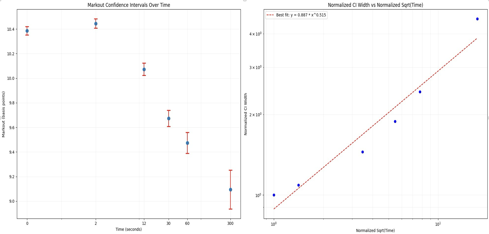

# CEX-DEX Inspector

The CEX-DEX inspector identifies arbitrage between centralized and decentralized exchanges. While on-chain DEX trades are visible, CEX orderbook data does not reveal the specific parties involved on either side of a fill. Using the available CEX data the inspector estimates the value extracted from onchain LPs via just-in-time CEX markouts with the methodology described below.

> **Note**
> Work in Progress: This methodology is currently under development and subject to change. We welcome feedback and contributions as we refine our approach.

## Background Information

In market microstructure research, two fundamental concepts are used to analyze trading costs and market quality: effective spread and realized spread. These measures provide different perspectives on the costs faced by market participants and the information content of trades.

- _Effective Spread_: The effective spread is a measure of the execution cost for a single transaction, calculated relative to the midpoint price at the time of the trade. It captures the immediate cost of demanding liquidity in the market.

- _Realized Spread_: The realized spread, on the other hand, is an ex-post measure that attempts to capture the non-information related component of the trading cost. It is calculated by comparing the trade price to a future midpoint price. This future midpoint price is offset from the instantaneous time of execution by a fixed markout period.

The realized spread aims to separate the transitory component of the spread (due to order processing costs and inventory risk) from the permanent component (due to adverse selection or information asymmetry). The use of a future price in calculating the realized spread is based on the intuition that trades themselves convey information to the market. This concept is rooted in the idea of price discovery and information asymmetry in financial markets.

1. **Information Content of Trades**: When a trade occurs, it potentially signals private information held by the trader. This information is gradually incorporated into the market price following the trade.

2. **True Price Indication**: As time passes after a trade, the price is expected to move towards its "true" value as more information becomes available and is processed by market participants. Therefore, a future price is often considered more indicative of the true asset value at the time of the original trade.

3. **Separating Permanent and Temporary Effects**: By using a future price, we attempt to distinguish between the permanent price impact of a trade (related to new information) and temporary effects (such as inventory imbalances or liquidity demands).

However, the choice of the time interval for the future price involves a trade-off. A very short interval might not allow enough time for information to be fully incorporated into the price, potentially underestimating the information content of the trade. On the other hand, an excessively long interval introduces more noise into the measurement. This noise comes from subsequent trading activities, new information arrivals, or broader market movements unrelated to the original trade.

## Core Methodology

The core insight is that CEX-DEX arbitrageurs, whether they are trading against on-chain AMMs and hedging instantaneously on a more-liquid centralized exchange or just using the deepest centralized exchange as an accurate oracle that they can utilize to repeatedly extract AMM liquidity at better-than-true price, are taking on-chain liquidity preferentially based on the instantaneous CEX price.

The initial CEX-DEX inspector filter thus looks at all AMM swaps with relative execution prices that are favorable (above a $1.5 in profit after gas for unknown addresses, and positive pnl for know searchers, searchers with more than 20 profitable cex-dex arbs with pnl greater than 1.5 each) to the instantaneous centralized exchange mid price at the most liquid centralized exchange for that given asset pair. This implies that the instantaneous markout to centralized exchanges is always positive for a CEX-DEX arb (or else, if they're trading on some directional alpha, it would make sense for them to employ the same strategy on the centralized exchange given their sophistication).

But, the arbitrageurs favorable on-chain swap also leaks some ex-post information that affects true price. We thus need to determine the optimal markout time to determine the expected true value of these arbitrages. Note that, given we're operating on a true value basis, we're able to compare the extraction from on-chain LPs from arbitrageurs _irrespective_ of the specific strategy that the arbitrageur is running (of which, there are several).

We look at markout intervals of 2 seconds, 12 seconds, 30 seconds, 1 minute, and 5 minutes.

When we query all expected CEX-DEX arbitrages using the above filtering methodology on ETH/USDT marked out against Binance mid price at the aforementioned future time intervals for each trade, we get the following graph:

 

We can see that, as a sanity check, the confidence interval length of each markout grouping is scaling with the square root of time, as expected from theory of stochastic processes. We see that, as expected, the information of the arbitrageurs swap takes time to settle into the market and effect the future true price of the asset. That being said, given that all markouts are within slightly more than a 10% interval of each other (denominated in bps), this information does not have a drastic effect on the future true price. We thus chose a markout time of 5 minutes to provide a happy medium between letting the trade information settle in the market while also not being too noisy of an estimate. As an added benefit is that this is consistent with much traditional finance markout literature.

## Assumptions and Future Work

### Future Work

- Factor in specific arbitrageur strategies
- Provide more rigorous justification for the specific threshold chosen for improvement over instantaneous mid price (for filtering logic)
- Chose a markout window for each asset pair specifically
- Create methodology to better analyze where we're detecting false positives
