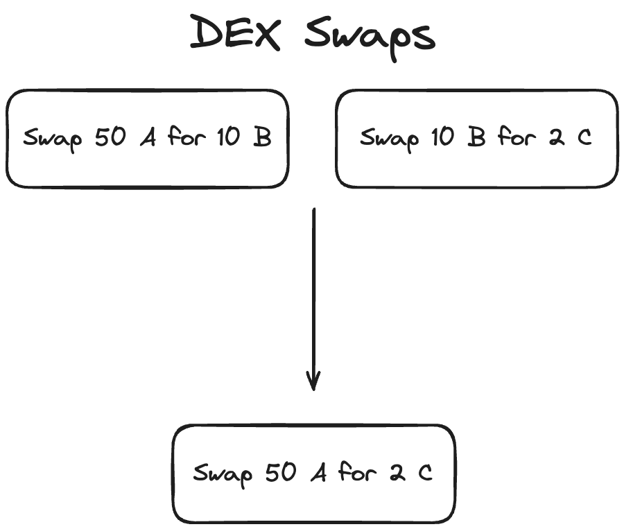
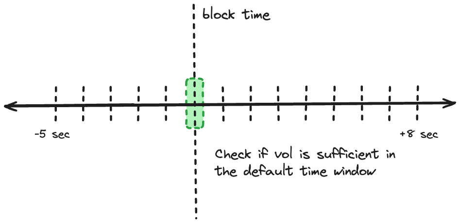
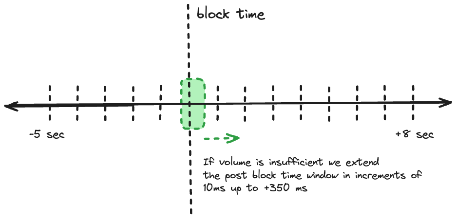
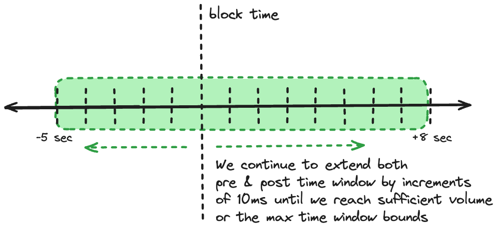

# Cex-Dex Inspector

The Cex-Dex inspector identifies arbitrage between centralized and decentralized exchanges. While on-chain DEX trades are visible, CEX trades must be inferred. Using available CEX trade data the inspector estimates likely CEX trade prices to approximate the full arbitrage strategy and its profitability.

**What is Cex-Dex Arbitrage?**

Centralized exchanges (CEX) and decentralized exchanges (DEX) operate on fundamentally different time scales. CEX function in continuous time, allowing trades to be executed at any moment without interruption. In contrast, DEX operate in discrete time intervals, as trades are only executed upon inclusion in a new block - leaving prices stale in between blocks. Consequently, DEX prices consistently lag behind the more frequently updated CEX prices, creating arbitrage opportunities between the two exchange types.

## Methodology

> **Note**
> Experimental Methodology - Work in Progress!
>
> This methodology is highly experimental and currently under active development. Key points to consider:
>
> It has been built iteratively based on continuous testing and real-world observations, rather than a comprehensive theoretical framework.
>
> Many parameters within the methodology have been set arbitrarily based on experimentation. These settings require further testing and analysis before we can present this as a credible framework.
>
> We offer this glimpse into our work-in-progress to encourage community engagement. It is not yet a finalized or validated approach.
>
> We strongly encourage users to approach these results with a critical eye. Your feedback, insights, criticisms, and contributions are invaluable as we refine and improve this methodology.
>
> Please share your experiences, observations, and any issues you encounter. This will help us enhance the accuracy, reliability of this approach.

### Step 1: Identify Potential Arbitrage Transactions

First, the inspector collects all block transactions involving `swap`, `transfer`, `eth_transfer`, `aggregator_swap` actions.

Then, for each transaction it:

1. Discards transactions if it's a solver settlements or from a known DeFi automation bot.
2. Extract DEX swaps and transfers.
3. If no swaps are found, attempt to reconstruct swaps from transfers.
4. Discard transactions that represent atomic arbitrage (where trades form a closed loop).

### Step 2: Merge Sequential Swaps

 

We merge sequential swaps to match on-chain routes with off-chain markets. Here's why:

- On-chain and off-chain liquidity often differ. For example, PEPE-WETH might be the most liquid pair on-chain, while PEPE-USDT dominates off-chain.
- Arbitrageurs might swap PEPE-WETH then WETH-USDT on-chain to arbitrage against the PEPE-USDT off-chain market.
- By merging these on-chain swaps (PEPE-WETH-USDT into PEPE-USDT), we align our analysis with the actual off-chain trade.

Our `merge_possible_swaps` function combines these sequential swaps, allowing us to evaluate CEX prices more precisely.

### Step 3: CEX Price Estimation

To estimate the CEX price the arbitrageur traded at, we use two distinct methods

### A. Dynamic Time Window VWAP

This method calculates a Volume Weighted Average Price (VWAP) within a dynamic time window around each block. We use a dynamic window to capture diverse arbitrage scenarios across different market conditions.

#### Why a Dynamic Window?

1. Highly Competitive Markets (e.g., ETH/USDT):

   - Arbitrageurs face uncertainty about DEX trade inclusion until block proposal because of high competition of other arbitrageurs seeking the same opportunity.
   - High volume allows rapid trade execution close to block time.
   - Window: Narrow, focused around and shortly after block time.

2. Less Competitive and Low-Volume Markets:
   - Lower trade volume reduces concerns about DEX trade inclusion.
   - Arbitrageurs have more flexibility in timing CEX execution.
   - Focus shifts to optimizing execution and minimizing price impact.
   - Traders may need extended time to clear positions without excessive slippage.
   - Insufficient off-chain volume in tight windows may obscure arbitrage activity.
   - Window: Wider, allowing for gradual execution strategies and capturing sparse but significant arbitrage events.

#### Determining the Trade Time Window

We expand the time window in three phases:

1. Default Window

 

- Setting: -20 +80 milliseconds around block time
- Purpose: Capture highly competitive, time-sensitive arbitrages

2. Initial Extension

 

- Action: Extend post-block time up to 350ms in 10ms increments
- Rationale: Traders gain certainty post-block, likely executing shortly after

3. Full Extension

 

- Action: Extend both pre and post-block time up to -10/+20 seconds
- Purpose: Capture less competitive arbitrages and low-volume pair activity

### B. Optimistic Execution Calculation

This method provides an optimistic estimate of potential arbitrage profitability, while attempting to minimize lookahead bias.

#### Process

1. Dynamic Time Window:

   - Start with a narrow window: ±200 milliseconds around block time.
   - Expand the window progressively if needed, favoring post-block expansion:
     - Extend post-block time up to 450ms in 10ms increments.
     - If necessary, extend both pre and post-block time up to -5/+8 seconds.

2. Volume Allocation:

   - Calculate total volume needed for arbitrage ($x$) and total trade volume across all time baskets ($y$).
   - For each time basket $i$, calculate volume allocation: \\(V_i = (z_i / y) \* x) \\)
     where \\(z_i \\) is the volume in basket \\(i \\) .

3. Trade Sorting and Selection:

   - Within each time basket:
     a. Sort trades by price, from most to least advantageous.
     b. Select top trades based on a quality parameter (e.g., top 20%).
     c. Fill up to the volume allocation \\(V_i\\) for that basket.

4. Progressive Filling:

   - Start from the basket closest to block time (usually just after).
   - If a basket can't fulfill its allocation, distribute the remainder to subsequent baskets.

5. Price Calculation:
   Calculate the final price using volume weights:
   $$\text{FinalPrice} = \frac{\sum(Price_i * V_i)}{\sum V_i}$$

6. Lookahead Mitigation:
   - Implement a "sliding window" approach within the dynamic window.
   - For each trade, only consider information from its timestamp and before.

#### Key Considerations

- The dynamic window adapts to market conditions (competitive vs. less liquid markets).
- Volume allocation respects market liquidity while prioritizing times close to block confirmation.
- The quality parameter allows for optimistic selection without assuming perfect execution.
- Progressive filling and sliding window approach reduce lookahead bias.
- The method balances optimism with realism, providing a nuanced view of potential arbitrage opportunities.

### Step 4: Calculate Potential Arbitrage Profits

For each swap and CEX price estimate:

1. Calculate the price difference between DEX and CEX.
2. Estimate potential profit by comparing how much the trader would receive by purchasing token in on the Cex using the token out amount of the swap.
3. Calculate profits using both mid-price and ask price.

### Step 5: Aggregate and Analyze Results

1. Calculate profits for each CEX individually and for a global VWAP across all exchanges.
2. Determine the most profitable route across all exchanges.
3. Calculate optimistic profits based on the Optimistic VWAP.

### Step 6: Account for Gas Costs

Subtract the transaction's gas cost from the calculated profits for each scenario.

### Step 7: Validate and Filter Potential Arbitrages

A transaction is considered a valid Cex-Dex arbitrage if it meets any of the following conditions:

1. Profitable based on global VWAP or optimistic estimates.
2. Profitable on multiple exchanges.
3. Executed by an address with significant history of Cex-Dex arbitrage (>40 previous trades).
4. Labeled as a known Cex-Dex arbitrageur.

### Step 8: Handle Edge Cases and Outliers

1. Filter out high-profit outliers (>$10,000 profit) if they are only profitable on less liquid exchanges (Kucoin, Okex) to avoid false positives.
2. Apply stricter validation for stable coin pair arbitrages.
