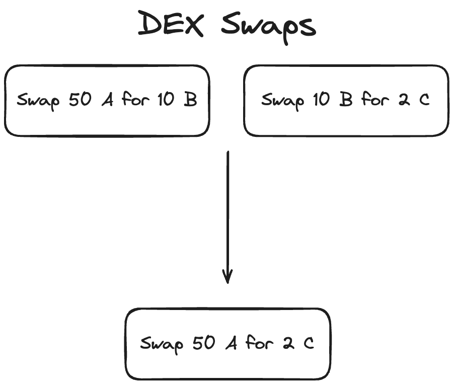
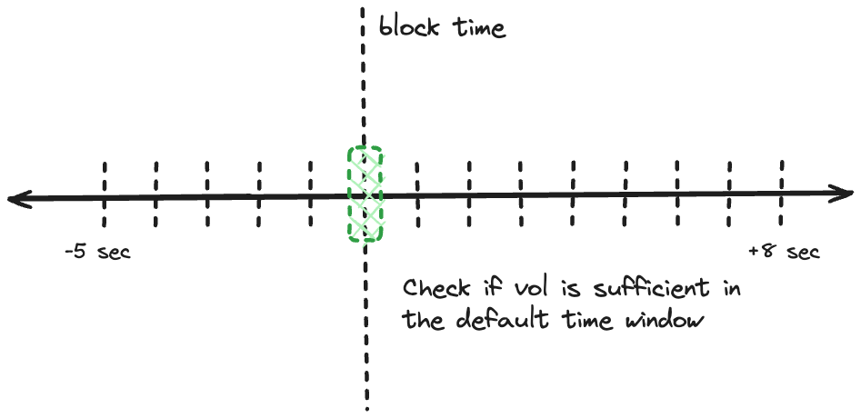
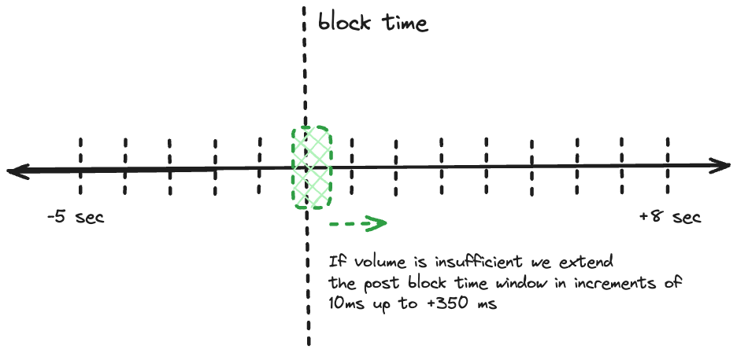
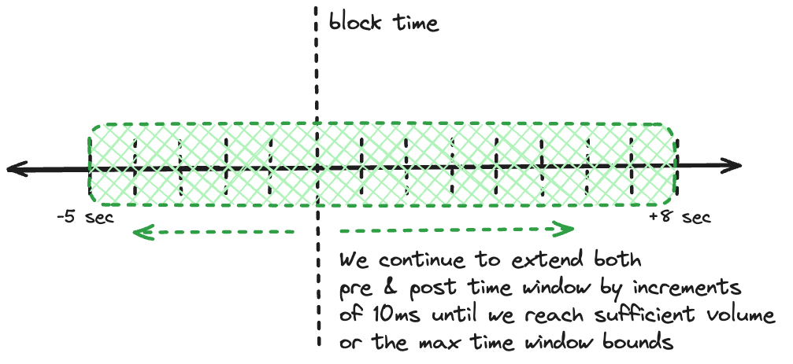

# Cex-Dex Inspector

The Cex-Dex inspector identifies arbitrage between centralized and decentralized exchanges. While on-chain DEX trades are visible, CEX trades must be inferred. Using available CEX trade data the inspector estimates likely CEX trade prices to approximate the full arbitrage strategy and its profitability.

**What is Cex-Dex Arbitrage?**

Centralized exchanges (CEX) and decentralized exchanges (DEX) operate on fundamentally different time scales. CEX function in continuous time, allowing trades to be executed at any moment without interruption. In contrast, DEX operate in discrete time intervals, as trades are only executed upon inclusion in a new block - leaving prices stale in between blocks. Consequently, DEX prices consistently lag behind the more frequently updated CEX prices, creating arbitrage opportunities between the two exchange types.

## Methodology

### Step 1: Identify Potential Arbitrage Transactions

First, the inspector collects all block transactions involving `swap`, `transfer`, `eth_transfer`, `aggregator_swap` actions.

Then, for each transaction it:

1. Discards transactions if it's a solver settlements or from a known DeFi automation bot.
2. Extract DEX swaps and transfers.
3. If no swaps are found, attempt to reconstruct swaps from transfers.
4. Discard transactions that represent atomic arbitrage (where trades form a closed loop).

### Step 2: Merge Sequential Swaps

<div style="text-align: center;">
 
</div>

We merge sequential swaps to match on-chain routes with off-chain markets. Here's why:

- On-chain and off-chain liquidity often differ. For example, PEPE-WETH might be the most liquid pair on-chain, while PEPE-USDT dominates off-chain.
- Arbitrageurs might swap PEPE-WETH then WETH-USDT on-chain to arbitrage against the PEPE-USDT off-chain market.
- By merging these on-chain swaps (PEPE-WETH-USDT into PEPE-USDT), we align our analysis with the actual off-chain trade.

Our `merge_possible_swaps` function combines these sequential swaps, allowing us to evaluate CEX prices more precisely.

### Step 3: CEX Price Estimation

To estimate the CEX price the arbitrageur traded at, we use two distinct methods

### A. Dynamic Time Window Volume Weighted Markouts

This method calculates a Volume Weighted Average Price (VWAP) within a dynamic time window around each block. We use a dynamic window to capture diverse arbitrage scenarios across different market conditions.

#### Why a Dynamic Window?

1. Highly Competitive Markets (e.g., ETH/USDT):

   - Arbitrageurs face uncertainty about DEX trade inclusion until block proposal because of high competition of other arbitrageurs seeking the same opportunity.
   - They often wait for block confirmation before executing the CEX leg.
   - High volume allows rapid trade execution close to block time.
   - Window: Narrow, focused around and shortly after block time.

2. Less Competitive and Low-Volume Markets:
   - Lower trade volume reduces concerns about DEX trade inclusion.
   - Arbitrageurs have more flexibility in timing CEX execution.
   - Focus shifts to optimizing execution and minimizing price impact.
   - Traders may need extended time to clear positions without excessive slippage.
   - Insufficient off-chain volume in tight windows may obscure arbitrage activity.
   - Window: Wider, allowing for gradual execution strategies and capturing sparse but significant arbitrage events.

#### Determining the Trade Time Window

We expand the time window in three phases:

1. Default Window
<div style="text-align: center;">
 
</div>

- Setting: ±50 milliseconds around block time
- Purpose: Capture highly competitive, time-sensitive arbitrages

2. Initial Extension
<div style="text-align: center;">
 
</div>

- Action: Extend post-block time up to 350ms in 10ms increments
- Rationale: Traders gain certainty post-block, likely executing shortly after

3. Full Extension
<div style="text-align: center;">
 
</div>

- Action: Extend both pre and post-block time up to -5/+8 seconds
- Purpose: Capture less competitive arbitrages and low-volume pair activity

#### Adjusted Volume Weighted Average Price (VWAP)

We integrate volume data and time-based weights into our VWAP calculation:

$$
AdjustedVWAP = \frac{\sum (Price_i \times Volume_i \times TimingWeight_i)}{\sum (Volume_i \times TimingWeight_i)}
$$

This formula balances three key factors:

1. Trade price
2. Trade volume
3. Temporal proximity to block time

The result is a price estimate that reflects both market depth and the likely timing of arbitrage executions.

This method returns a `MakerTakerWindowVWAP` for each DEX swap:

```rust,ignore
pub struct WindowExchangePrice {
    pub exchange_price_with_volume_direct: FastHashMap<CexExchange, ExchangePath>,
    pub pairs: Vec<Pair>,
    pub global_exchange_price: Rational,
}
```

- `exchange_price_with_volume_direct`: Provides the prices and volumes for each exchange
- `pairs`: Shows the traded token pairs, which is useful when their isn't a direct pair on the CEX
- `global_exchange_price`: Represents the volume weighted average price across all exchanges

### B. Optimistic Execution Calculation

This method provides an upper bound on potential arbitrage profitability by assuming near optimal trade execution within a fixed time window.

#### Processes

1. Data Collection:

   - Gather all trades across all exchanges within a fixed time window. We currently set the default to -0.5 +2 seconds around the block time.

2. Trade Sorting:

   - Order trades from most to least advantageous price.
   - Most advantageous trades are those resulting in highest PnL for the arbitrageur.

3. Volume Filtering:

   - Remove trades with volume exceeding arbitrage requirements.
   - Apply a 10% buffer to account for potential volume variations.

4. Trade Selection:
   - Use a quality parameter (expressed as a percentage) to determine starting point in sorted trades.
   - Select most favorable trades up to the required clearance amount.

#### Key Considerations:

TODO: Changes to optimistic execution calculation

- Break up the trade window into smaller trade baskets
- use the quality parameter to select trades on this basis
-

- This method assumes perfect foresight and execution, providing a "best-case" scenario.
- It's useful for identifying the maximum potential of an arbitrage opportunity.
- The fixed time window and quality parameter are configurable to adjust for different market conditions.

This method returns a `MakerTaker` for each DEX swap:

```rust,ignore
pub type MakerTaker = (ExchangePrice, ExchangePrice);

pub struct ExchangePrice {
    pub trades_used: Vec<OptimisticTrade>,
    pub pairs: Vec<Pair>,
    pub final_price: Rational,
}
```

- `trades_used`: Lists the specific trades used in the optimistic calculation
- `pairs`: Indicates the token pairs involved
- `final_price`: Represents the optimistic execution price

In the next step, we'll explore how we use these price estimates to calculate the actual arbitrage PnL, considering both realistic market conditions and best-case scenarios.

### C. Updated Optimistic Execution Calculation

This method provides an optimistic yet realistic estimate of potential arbitrage profitability, adapting to market conditions while minimizing lookahead bias.

#### Process

Question A: To decay or not to decay?

- Yes, but less than VWAP

Question B: How much should I extend the time window?

- Expand by 1.5x for search

Question C: How much volume should I attribute to each time basket?

- volume weight proportion + time decay weight

Question D: How big should the time baskets be?

- Scale them to 1/20 of time window

- Max should be 200ms
- Min should be 20ms

Question E: Should I remove trades that are larger than the total amount required to clear?

1. Dynamic Time Window:

   - Start with a narrow window: ±200 milliseconds around block time.
   - Expand the window progressively if needed, favoring post-block expansion:
     a. Extend post-block time up to 450ms in 10ms increments.
     b. If necessary, extend both pre and post-block time up to -5/+8 seconds.

2. Trade Weighting:
   Apply the bi-exponential decay function to weight trades:

   ```
   Weight(t) =
   {
     e^(-λ_pre * (BlockTime - t))  if t < BlockTime
     e^(-λ_post * (t - BlockTime)) if t ≥ BlockTime
   }
   ```

3. Volume Allocation:

   - Calculate total volume needed for arbitrage (x) and total trade volume across all time baskets (y).
   - For each time basket i, calculate initial volume allocation: V_i = (z_i / y) \* x
     where z_i is the volume in basket i.
   - Apply time weights to adjust allocations: V*i_adjusted = V_i * w*i / Σ(V_j * w_j)
     where w_i is the bi-exponential weight for basket i.

4. Trade Sorting and Selection:

   - Within each time basket:
     a. Sort trades by price, from most to least advantageous.
     b. Select top trades based on a quality parameter (e.g., top 20%).
     c. Fill up to the adjusted volume allocation (V_i_adjusted) for that basket.

5. Progressive Filling:

   - Start from the basket closest to block time (usually just after).
   - If a basket can't fulfill its allocation, distribute the remainder to subsequent baskets.

6. Price Calculation:
   Calculate the final price using both volume and time weights:

   ```
   FinalPrice = Σ(Price_i * V_i_adjusted * w_i) / Σ(V_i_adjusted * w_i)
   ```

7. Lookahead Mitigation:
   - Implement a "sliding window" approach within the dynamic window.
   - For each trade, only consider information from its timestamp and before.

#### Key Considerations:

- The dynamic window adapts to market conditions (competitive vs. less liquid markets).
- Bi-exponential weighting favors trades closer to block time, reflecting real execution patterns.
- Volume allocation respects market liquidity while prioritizing times close to block confirmation.
- The quality parameter allows for optimistic selection without assuming perfect execution.
- Progressive filling and sliding window approach reduce lookahead bias.
- The method balances optimism with realism, providing a nuanced view of potential arbitrage opportunities.

This refined approach provides a realistically optimistic estimate of CEX prices for arbitrage calculations, respecting market dynamics and execution constraints while acknowledging arbitrageur sophistication.

### Step 4: Calculate Potential Arbitrage Profits

For each swap and CEX price estimate:

1. Calculate the price difference between DEX and CEX.
2. Estimate potential profit for both buying on DEX and selling on CEX, and vice versa.
3. Calculate profits using both mid-price and ask-price scenarios.

### Step 5: Aggregate and Analyze Results

1. Calculate profits for each CEX individually and for a global VWAM across all exchanges.
2. Determine the most profitable route across all exchanges.
3. Calculate optimistic profits based on the Optimistic VWAP.

### Step 6: Account for Gas Costs

Subtract the transaction's gas cost from the calculated profits for each scenario.

### Step 7: Validate and Filter Potential Arbitrages

A transaction is considered a valid Cex-Dex arbitrage if it meets any of the following conditions:

1. Profitable based on global VWAM or optimistic estimates.
2. Profitable on multiple exchanges.
3. Executed by an address with significant history of Cex-Dex arbitrage (>40 previous trades).
4. Labeled as a known Cex-Dex arbitrageur.
5. Is a private transaction with direct builder payment.
6. Uses a known MEV contract.
7. Shows significant profit on a single exchange (excluding stable coin pairs).

### Step 8: Handle Edge Cases and Outliers

1. Filter out high-profit outliers (>$10,000 profit) on specific exchanges (Kucoin, Okex) to avoid false positives.
2. Apply stricter validation for stable coin pair arbitrages.

### Step 9: Prepare Final Output

For validated Cex-Dex arbitrages, compile detailed information including:

1. Transaction details (hash, gas costs, etc.)
2. DEX swap details
3. Estimated CEX prices and trade details
4. Calculated profits for various scenarios (global VWAM, per-exchange, optimistic)
5. Time windows used for price estimations

The inspector outputs this information as a `Bundle` containing `BundleData::CexDex` for further analysis and reporting.
