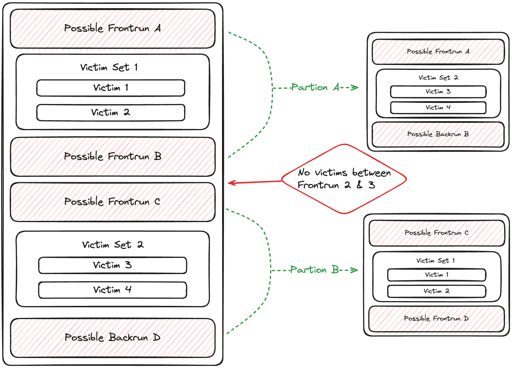
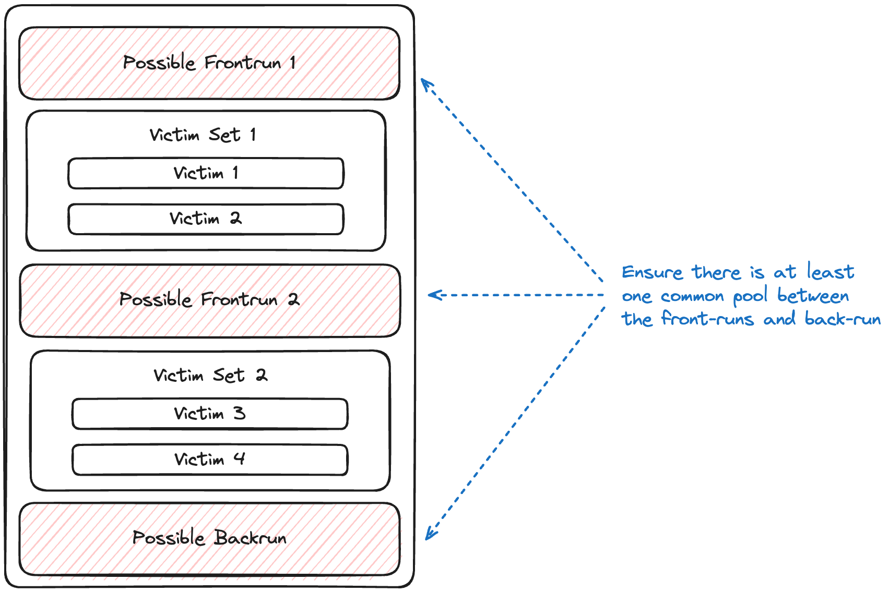
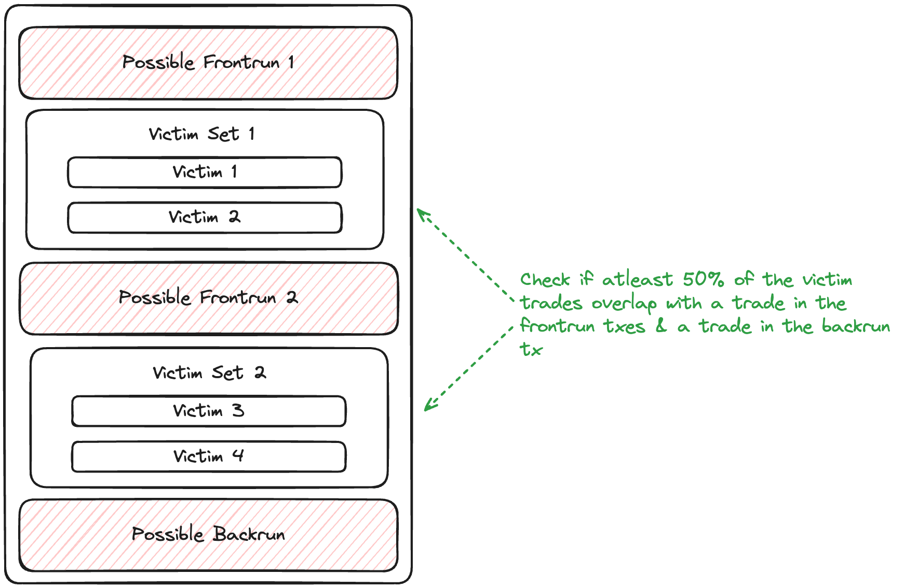
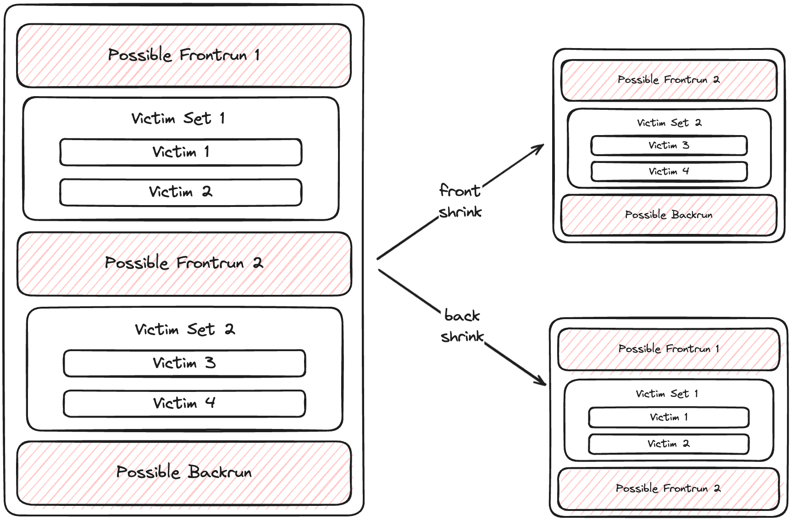

# Sandwich Inspector

The Sandwich Inspector is designed to detect and analyze the profitability of Sandwich attacks.

**What is a Sandwich Attack?**

A Sandwich attack unfolds in three steps:

1. **Front-run:** An attacker buys an asset just before a victim's transaction, raising its market price.
2. **Victim Transaction:** The victim purchases the asset at the inflated price.
3. **Back-run:** The attacker sells the asset post-victim transaction, profiting from the price difference.

## Methodology

### Step 1: Retrieve Relevant Transactions

The inspector retrieves transactions in the block that involve `swap`, `transfer`, `eth_transfer`, `FlashLoan`, `batch_swap` or `aggregator_swap` actions.

### Step 2: Identify Potential Sandwiches

We run two functions to find possible sandwich attacks:

1. One checks for repeated transactions from the same account: [`get_possible_sandwich_duplicate_senders`](https://github.com/SorellaLabs/brontes/blob/5b1d1b4e30d5c92b2a0bc56ff4dd441aed533681/crates/brontes-inspect/src/mev_inspectors/sandwich/mod.rs#L1045)
2. The other looks for repeated calls to the same contract: [`get_possible_sandwich_duplicate_contracts`](https://github.com/SorellaLabs/brontes/blob/5b1d1b4e30d5c92b2a0bc56ff4dd441aed533681/crates/brontes-inspect/src/mev_inspectors/sandwich/mod.rs#L1107)

We use the `PossibleSandwich` type to represent each potential attack:

```rust, ignore
pub struct PossibleSandwich {
    pub eoa:                   Address,
    pub possible_frontruns:    Vec<B256>,
    pub possible_backrun:      B256,
    pub mev_executor_contract: Address,
    // Mapping of possible frontruns to the set of possible
    // victims. By definition the victims of latter transactions
    // can also be victims of the former
    pub victims:               Vec<Vec<B256>>,
}
```

This type holds the attacker's address, frontrun and backrun transactions, the contract used, and sets of victim transactions grouped by frontrun.

#### How It Works

Our algorithm constructs the largest possible sandwich scenarios by identifying duplicate addresses. Here's the process:

1. **Track Duplicates**

   - Map addresses (contract or EOA) to their most recent transaction hash

2. **Build Victim Sets**

   - For each transaction, track potential victims (transactions that occur after it)

3. **Construct a `PossibleSandwich`**

   - When we encounter a duplicate address, we create or update a `PossibleSandwich`:

     a) For the first duplicate:

     - Create a new PossibleSandwich
     - Set the previous transaction as the frontrun
     - Set the current transaction as the backrun
     - Add intervening transactions as victims

     b) For subsequent duplicates:

     - Add the previous transaction to possible frontruns
     - Update the backrun to the current transaction
     - Add the new set of victims

#### The Result

This step yields a list of `PossibleSandwich`. Each represents a potential sandwich attack, from simple to complex.

We catch what we call "Big Mac" sandwiches - attacks with multiple frontrun transactions, each targeting its own set of victims. [Read more about these complex patterns](https://github.com/SorellaLabs/brontes/blob/5b1d1b4e30d5c92b2a0bc56ff4dd441aed533681/crates/brontes-types/src/mev/sandwich.rs#L29).

We remove duplicates from our list. What remains are the largest, most comprehensive sandwich scenarios in the block. This wide-net approach ensures we don't miss any potential sandwiches, no matter how intricate. We'll analyze the details in later steps.

### Step 3: Partitioning Possible Sandwiches

Here's how partitioning works:

- We iterate through victim sets in each sandwich.
- Empty victim sets signal a break in the sandwich.
- We create new `PossibleSandwich` structs at these breaks.

<div style="text-align: center;">
 
</div>

> **Note:** Our partitioning assumes attackers maximize efficiency. Multiple attacker transactions without intervening victims may lead to unexpected results. If you find examples breaking this assumption, please report them for a bounty.

### Step 4: Analyze Possible Sandwich Attacks

#### Pool Overlap Check

Front-run and back-run transactions must swap on at least one common liquidity pool.

<div style="text-align: center;">
 
</div>

#### Victim Verification

After confirming pool overlap, we validate interleaved transactions as victims:

1. Group victim transactions by EOA to account for multi-step victim operations (e.g., approval and swap).
2. An EOA is a victim if it:
   - Swaps on the same pool and direction as the front-run
   - Swaps on the same pool and opposite direction as the back-run

<div style="text-align: center;">
 
</div>

A `PossibleSandwich` is confirmed if:

- At least 50% of EOAs are considered victims
- At least one complete sandwich is detected (e.g a victim swap overlaps with both front-run and back-run in pool & direction)

If confirmed, we proceed to Step 5. Otherwise, we initiate recursive verification.

#### Recursive Sandwich Verification

For unconfirmed sandwiches, we employ a recursive strategy to explore all possible transaction combinations:

<div style="text-align: center;">
 
</div>

1. The process stops after 6 recursive iterations.
2. We apply two types of "shrinking":

   **Back Shrink**:

   - Remove the last victim set
   - Use the last front-run as the new back-run
   - Recalculate the sandwich (run step 4 on the new sandwich)

   **Front Shrink**:

   - Remove the first victim set
   - Remove the first front-run transaction
   - Retain the original back-run
   - Recalculate the sandwich (run step 4 on the new sandwich)

3. We continue this process as long as:
   - There's more than one front-run transaction
   - Victim sets aren't empty
   - At least one victim has non-empty swaps or transfers

### Step 5: Calculate Sandwich PnL

For confirmed sandwiches:

1. Calculate searcher revenue: Balance deltas of searcher addresses & sibling address (e.g piggy bank address) if applicable
2. Calculate searcher cost: Sum of gas costs for all attacker transactions
3. Profit = Revenue - Cost
